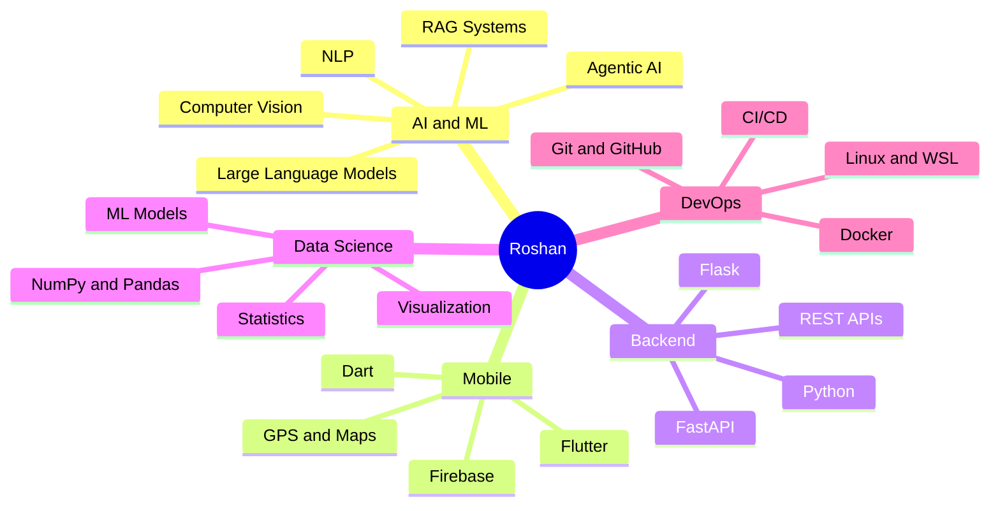

<div align="center">

<!-- Animated Header Banner -->


<!-- Typing Animation -->
<a href="https://git.io/typing-svg">
  
</a>

<br/>

<!-- Social Badges -->
[](https://github.com/roshanalexander22)
[](https://github.com/roshanalexander22)

</div>

---

<!-- About Me Section -->


### 👨‍💻 About Me

```python
class RoshanAlexander:
    def __init__(self):
        self.name        = "Roshan Alexander"
        self.role        = "AI Engineer & CS Student"
        self.location    = "Kerala, India 🇮🇳"
        self.education   = [
            "B.Tech CSE @ GEC Idukki",
            "BS AI & DS @ IIT Guwahati"
        ]
        self.languages   = ["Python", "Dart", "C++", "Java", "JS"]
        self.focus_areas = ["RAG", "LLMs", "Agentic AI", "Flutter"]
        self.open_to     = "Collaborations & Open Source"

    def say_hi(self):
        print("Thanks for dropping by! Let's build something amazing 🚀")

me = RoshanAlexander()
me.say_hi()
```

- 🔭 Currently building **AI-Powered RAG Applications** with local LLMs
- 🌱 Exploring **Agentic AI, LangGraph, MCP & System Design**
- 💡 Passionate about **LLMs, Computer Vision & Geospatial Computing**
- 🤝 Open to collaborating on **Open Source AI & Flutter projects**
- ⚡ Fun fact: *I run LLMs locally before deploying them to the cloud!*

<br clear="right"/>

---

## 🚀 Current Focus

<div align="center">

| 🧠 AI & LLMs | 📱 Mobile | 🛠 Engineering |
|:---:|:---:|:---:|
| Retrieval-Augmented Generation | Flutter Development | Backend APIs |
| Large Language Models | Material Design | Python Automation |
| Agentic AI & LangGraph | Google Maps Flutter | Docker & DevOps |
| Local LLM Deployment (Ollama) | Location Services | System Design |

</div>

---

## 🛠️ Tech Stack

<div align="center">

### 💻 Languages


### 🤖 AI / Machine Learning


### 📱 Mobile Development


### 🌐 Backend & APIs


### 🗄️ Databases


### 🛠 Tools & Platforms


</div>

---

## 🌟 Featured Projects

<div align="center">

### 🧠 AI-Powered RAG Assistant

> *An intelligent document question-answering system built with local LLMs*

| Feature | Tech |
|:---|:---|
| 🔍 Semantic Search | Vector Embeddings + FAISS / ChromaDB |
| 🤖 Local LLM Inference | Ollama + Qwen Models |
| 📄 Document Processing | LangChain + Python |
| 💬 Conversational Memory | RAG Pipeline |


</div>

---

## 📊 GitHub Stats

<div align="center">


</div>

<div align="center">


</div>

<div align="center">
  
</div>

---

## 🎯 Currently Learning

<div align="center">

```
🔄 Advanced RAG Techniques          ████████░░  80%
🤖 Agentic AI & LangGraph           ██████░░░░  60%
🔗 MCP (Model Context Protocol)     █████░░░░░  50%
🐳 Docker & Containerization        ████░░░░░░  40%
☸️  Kubernetes                       ███░░░░░░░  30%
☁️  Cloud Deployment                 ████░░░░░░  40%
🏗️  System Design                    █████░░░░░  50%
⚙️  CI/CD Pipelines                  ████░░░░░░  40%
```

</div>

---

## 📚 Areas of Expertise

<div align="center">



</div>

---

## 🏆 GitHub Trophies

<div align="center">


</div>

---

## 📈 Contribution Snake

<div align="center">

<picture>
  <source media="(prefers-color-scheme: dark)" srcset="https://raw.githubusercontent.com/roshanalexander22/roshanalexander22/output/github-contribution-grid-snake-dark.svg"/>
  <source media="(prefers-color-scheme: light)" srcset="https://raw.githubusercontent.com/roshanalexander22/roshanalexander22/output/github-contribution-grid-snake.svg"/>
  
</picture>

</div>

---

## 🤝 Let's Connect

<div align="center">

[](https://linkedin.com/in/roshanalexander22)
[](https://github.com/roshanalexander22)
[](mailto:roshanalexander22@gmail.com)

</div>

---

<div align="center">


<sub>⭐ <em>If you find my work interesting, feel free to star my repositories!</em></sub>

<br/>

**"The best way to predict the future is to build it." — Alan Kay**

</div>
